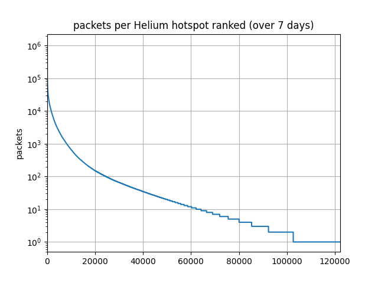

# Helium Data Traffic Analysis
## Background
[Helium](https://www.helium.com/) is a LoRaWAN network built on a blockchain, to provide incentives to run a 'hotspot' that provides network coverage for IoT devices using LoRaWAN radio technology. It has been growing extremely fast, adding over 80,000 hotspots per month, with at the start of 2022 more than half a million already installed and providing coverage (except for the ones run by scammers; location spoofing is a big problem for the Helium network).

Of course the assumption is that more and more people will start using this network to send real IoT device data. Sending data over the network is very cheap, and uses [Data Credits (DC)](https://docs.helium.com/use-the-network/console/data-credits). 

**The question we are trying to answer here is, nevermind the hype, how much real data traffic does the Helium network currently see?**

[Web3Index](https://web3index.org/helium) does an excellent job showing the trend of DC related to data traffic, but here we want to dig a bit deeper to check data packet numbers vs hotspots: how many hotspots are actually doing real work?

## Hotspot analysis

This plot is based on 7 days of traffic data (9-16 Feb 2022).



The [helium_data_traffic_extraction.py](helium_data_traffic_extraction.py) script tells us (see [extraction_sample_output.txt](extraction_sample_output.txt)):

- Total number of data packets was 82,130,820 or 11,732,974 per day
- Total number of active hotspots was 122,258
- The average DC per data packet was 1.63
- The average DC value of the total traffic per day was USD 191
- The most active hotspot saw 1.38% of total data packets. Its location has not been set, but searching it up on [Explorer](https://explorer.helium.com/hotspots/11npZsFTPjND7bZZfnk2mcQfryaQJDRYWcr2nwiy584bdvc6pAY) shows that its owner has 33 hotspots in Taiwan. Taiwan dominates the list of most active hotspots.
- Only 54 hotspots account for 20% of all data traffic in this period
- Half of the active hotspots saw less than 10 packets over a week

With 'active hotspot' I mean a hotspot that sees real data traffic, not only the Proof-of-Coverage exchanges. 

## Country analysis
I made a [Google Map](https://www.google.com/maps/d/edit?mid=17hSI7ZxKkPSpJSIFSjUvicPkCYtHBkMg&usp=sharing) showing the 2,000 most active hotspots (70% of total data traffic).
 


And this is the list of most active countries based on the 7,000 most active hotspots in the above week. It also shows the average packets per hotspot, with 2 clear outliers: Taiwan and The Bahamas. ('fail' is a set of 90 hotspots for which the API call for details failed, I did not bother to re-try).

|country | packet count | share of traffic | hotspot count | avg packets per hotspot |
|-----------|----------:|----------:|--------:|------:|         
|Taiwan          |10,889,283          |14.71%           |95               |114,624|
|Serbia          |10,676,756          |14.42%          |757                |14,104|
|Greece           |9,380,946          |12.67%          |577                |16,258|
|France           |7,824,936          |10.57%          |748                |10,461|
|United States    |7,390,235           |9.98%        |1,131                 |6,534|
|Sweden           |6,037,877           |8.16%          |624                 |9,676|
|Germany          |3,379,396           |4.57%          |239                |14,140|
|Spain            |3,235,256           |4.37%          |285                |11,352|
|United Kingdom   |2,736,144           |3.70%          |357                 |7,664|
|Turkey           |1,310,688           |1.77%          |355                 |3,692|
|Lithuania        |1,186,031           |1.60%          |183                 |6,481|
|Italy            |1,115,696           |1.51%          |141                 |7,913|
|Netherlands        |907,577           |1.23%          |224                 |4,052|
|Switzerland        |849,860           |1.15%          |146                 |5,821|
|The Bahamas        |765,755           |1.03%           |11                |69,614|
|fail               |725,098           |0.98%            |0                   |inf|
|China              |721,135           |0.97%           |70                |10,302|
|Latvia             |388,932           |0.53%          |103                 |3,776|
|Canada             |338,463           |0.46%           |71                 |4,767|
|Georgia            |261,502           |0.35%           |88                 |2,972|
|Romania            |260,670           |0.35%           |58                 |4,494|
|Norway             |246,787           |0.33%           |30                 |8,226|
|Hungary            |238,782           |0.32%           |92                 |2,595|
|Portugal           |236,827           |0.32%           |84                 |2,819|
|Poland             |216,773           |0.29%           |23                 |9,425|
|Thailand           |192,455           |0.26%           |26                 |7,402|
|Slovenia           |159,028           |0.21%           |61                 |2,607|
|Estonia            |151,687           |0.20%           |55                 |2,758|
|Belgium            |120,043           |0.16%           |26                 |4,617|
|Australia          |104,269           |0.14%           |21                 |4,965|
|Slovakia            |94,683           |0.13%           |39                 |2,428|
|Colombia            |85,544           |0.12%           |19                 |4,502|
|Lebanon             |73,234           |0.10%           |30                 |2,441|
|Denmark             |64,882           |0.09%           |17                 |3,817|
|Ukraine             |61,862           |0.08%           |21                 |2,946|
|South Africa        |54,308           |0.07%           |11                 |4,937|
|Liechtenstein       |36,388           |0.05%            |4                 |9,097|
|Ireland             |33,061           |0.04%           |11                 |3,006|
|Czechia             |30,802           |0.04%           |11                 |2,800|
|Bulgaria            |29,216           |0.04%           |14                 |2,087|
|Croatia             |28,097           |0.04%           |14                 |2,007|
|Mexico              |21,820           |0.03%            |2                |10,910|
|Luxembourg          |19,663           |0.03%            |1                |19,663|
|Chile               |14,843           |0.02%            |4                 |3,711|
|Singapore           |13,846           |0.02%            |6                 |2,308|
|Austria              |8,353           |0.01%            |4                 |2,088|
|Brazil               |8,302           |0.01%            |5                 |1,660|
|Uruguay              |6,615           |0.01%            |1                 |6,615|
|South Korea          |5,491           |0.01%            |1                 |5,491|
|Puerto Rico          |5,243           |0.01%            |1                 |5,243|
|Zimbabwe             |4,879           |0.01%            |1                 |4,879|
|Philippines          |4,145           |0.01%            |2                 |2,072|
|Cyprus               |1,891           |0.00%            |1                 |1,891|
|Finland              |1,494           |0.00%            |1                 |1,494|
|India                |1,328           |0.00%            |1                 |1,328|


## Preliminary interpretation
(this is based on the above 7 day period, results may change over time)

- Only around 20% of the published Helium hotspots (574,000+) are involved in data traffic, the other 80% (450,000+) hotspots are not seeing any data traffic.
- At least 10% of data traffic is seen by a dozen hotspots in Taiwan, probably for stress testing devices/gateways. Germany also has some extremely busy hotspots.
- Around 90% of data traffic is seen by around 7,000 hotspots; in other words, 90% of traffic is handled by 1.2% of total installed hotspots.
- When running the analysis for the last 24 hours only, the number of active hotspots can go down to 10%, but the ratio of 90% of traffic seen by 7,000 hotspots seems to hold.
- Europe sees around 60% of the total data traffic, and the USA around only 10%, which is less than each of Serbia, Greece and France.

Note that although I hope this is interesting, data packet traffic is not a reliable metric to evaluate the actual use of the Helium network, as it can easily be inflated by people who have an interest to do so; that would be cheap both in terms of hardware and DC required. 

## Methodology

The details of data traffic transactions happen in **state channels**, a 'layer 2' technology to keep the huge number of transactions off the main 'layer 1' blockchain. Only the summaries of these DC transactions become part of the Helium blockchain. Helium allows us to access the blockchain via an [API](https://docs.helium.com/api/blockchain/introduction).

The python script [helium_data_traffic_extraction.py](helium_data_traffic_extraction.py) uses this API to analyse the data traffic:

- for a given NUMBER_OF_DAYS we retrieve all the state channels
- sum the data packets and DCs
- keep track of the data packets per hotspot
- rank this list to find the most active hotspots
- save this list as CSV, plot a graph and save as PNG
- list the most active hotspots with their location, until a given FRACTION_THRESHOLD is reached
- rank the countries of the most active hotspots

The only configuration parameters are at the top of the script:
```
FRACTION_THRESHOLD = 0.2    # cut the hotspot ranking when we reach this fraction 0-1
NUMBER_OF_DAYS = 3          # how many days to go back from now
```

Increasing `FRACTION_THRESHOLD` slows down the completion of the script, as it will make an API call for each hotspot to retrieve its location. 

I decided to use only the 7,000 most active hotspots, representing 90%  of total data traffic. The script [helium_hotspots_csv_details.py](helium_hotspots_csv_details.py) takes the csv output of above extraction script to retrieve hotspots details including locations. With this [output csv](csv_output/20220216145329hotspots_data_packets7_details.csv) I created the Google Map above, and I used this script [helium_data_traffic_country.py](helium_data_traffic_country.py) to create the country list, resulting in this [country_sample_output.txt](country_sample_output.txt).

## Disclaimer

It is very well possible that mistakes were made in the script and in the above interpretation, I am open to corrections and suggestions.

I got interested in Helium when I saw dozens of hotspots appearing in my area, which all turned out to be fake. I am trying to contribute to [mapping](https://cassiopeia.hk/finding-real-helium-hotspots-in-hong-kong) of real Helium network coverage in Hong Kong, and I remain a big fan of The Things Network.


 


