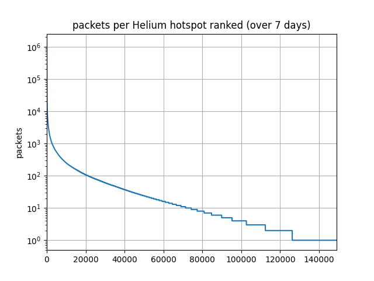
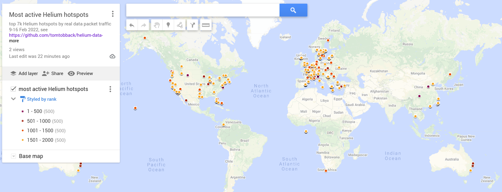

# Helium Data Traffic Analysis

updated 31 May 2022

## Background
[Helium](https://www.helium.com/) is a LoRaWAN network built on a blockchain, to provide incentives to run a 'hotspot' that provides network coverage for IoT devices using LoRaWAN radio technology. It has been growing extremely fast, adding over 80,000 hotspots per month, with at the start of 2022 more than half a million already installed and providing coverage (except for the ones run by scammers; location spoofing is a big problem for the Helium network).

Of course the assumption is that more and more people will start using this network to send real IoT device data. Sending data over the network is very cheap, and uses [Data Credits (DC)](https://docs.helium.com/use-the-network/console/data-credits). 

**The question we are trying to answer here is, nevermind the hype, how much real data traffic does the Helium network currently see?**

[Web3 Index](https://web3index.org/helium) does an excellent job showing the trend of DC related to data traffic: it is clear that despite the continuous growth of the Helium network, data traffic is still extremely small, and saw a significant drop in early May 2022.

](plot_output/20220531web3index.png)

Here we want to dig a bit deeper to check data packet numbers vs hotspots: how many hotspots are actually doing real work?

## Hotspot analysis

My Python script uses the [Helium Blockchain API](https://docs.helium.com/api/blockchain/introduction/) to retrieve data traffic information. It ranks the most active hotspots by data packet count, as this is the best indicator for real traffic (vs DC value as shown by the Web3 Index). 

The main findings are in the table below, and this plot is also revealing: it shows that only about 20,000 hotspots see any significant traffic (down to 100 packets per week), and only 149,000 (17.89% of the 800K+ proudly 'deployed' hotspots) see any traffic at all.
 
While this analysis is based on 7 days of traffic data (24-31 May 2022), the below plot looked very similar in Feb/March 2022.



The [helium_data_traffic_extraction.py](helium_data_traffic_extraction.py) script tells us (see [extraction_sample_output.txt](extraction_sample_output.txt)):

| | Feb 2022 | May 2022 | 
|-----------|----------:|----------:|  
|Total number of data packets over 7 days| 82,130,820 | 46,953,101|
|Average data packets per day|11,732,974 | 6,707,586|
|Total number of active hotspots| 122,258| 149,072|
|Active hotspots vs total Helium network| 21.27%| 17.89%|
|Average DC per data packet|1.63 |6.38 |
|Average DC value per day|USD 191.46 | USD 428.23|
|Most active single hotspot share of total traffic| 1.38% (161,930 packets/day)| 2.68% (179,727 packets/day)|
|Details of most active hotspot|[Rough Mango Starling](https://explorer.helium.com/hotspots/11npZsFTPjND7bZZfnk2mcQfryaQJDRYWcr2nwiy584bdvc6pAY): Browan/MerryIoT, its location had not been set, but Taiwan dominated the list of most active hotspots, probably related to stress testing | [Mammoth Mint Butterfly](https://explorer.helium.com/hotspots/14aQjjfit3hYoViBJVzFELpxZmXrP8oGkxycc5ou8Tjbrp72KY7): Data-Only Hotspot without location |
|Number of hotspots accounting for 20% of total traffic| 54 |  11|
|Traffic distribution over hotspots| Half of the active hotspots saw less than 10 packets over a week |Half of the active hotspots saw less than 10 packets over a week|

With 'active hotspot' I mean a hotspot that sees real data traffic, not only the Proof-of-Coverage exchanges. 

The most significant changes from Feb to May 2022:
 
* Total traffic in terms of data packets has dropped over 40% (comparing a week in Feb with a week in May 2022). Average daily traffic is 6.7 million packets.
* The average packet size has increased from 1.63 DC to 6.38 DC (factor of 4). The result is that while the number of packets has almost halved, the DC value has doubled.
* The top 60 most active hotspots now are all [Data-Only Hotspots](https://docs.helium.com/mine-hnt/data-only-hotspots/), i.e. different hardware from the mining hotspots. Regular hotspots (including the recent upgrade to Light Hotspots) participate in Proof-of-Coverage to earn HNT; Data-Only Hotspots only earn from data traffic.
* While it makes sense for manufacturers to stress test their hotspots, it seems rather strange that at the end of May 2022, the 60 most active hotspots are all Data-Only Hotspots, accounting for more than 50% of total traffic. None of them have their location set (except [1 in Sweden](13XomH7EZanderkHQKdrNeMx7XWDwk6hzobDnCmPcdZdmvNjdYL)).

## Country analysis (May 2022)
Based on the above ranking of most active hotspots I retrieved location information of the top 2,000 hotspots in the week 24-31 March. Below is the list grouped by 56 most active countries, accounting for 38,781,194 packets or 82% of the total traffic. It also shows the average packets per hotspot, with a few clear outliers:

* 'None' is the category of Data-Only Hotspots without asserted location, which take almost 70% of the total traffic, with only 85 hotspots. These hotspots see on average 1,885 packets per hour: they are over 50 times more busy than the 591 busiest hotspots in the USA.
* 'fail' is a category of Helium accounts that should be hotspots ('client' in the [state_channel summaries](https://docs.helium.com/api/blockchain/state-channels)) but are listed as 'account' in Explorer. There are [121](csv_output/20220531115029hotspots_data_packets7_details_fail.csv) of these in our list of 2,000 most active hotspots (in Feb 2022 there were 90 but i had assumed those were glitches).
* Compared to Feb 2022 (see below), USA traffic has dropped from 7M3 to 3M3 packets per week. The average packets per hotspot has not changed much, 5,642 vs 6,534 before. It can be assumed that some of the USA traffic has moved to Data-Only Hotspots, but it seems impossible to know for sure from the data.
* Taiwan has fallen from 1st place to 9th, or around 1% of total traffic, probably because some manufacturers stopped their stress testing. Maybe they are stress testing Data-Only Hotspots now, but as long as they don't assert the hotspots' locations, we don't know.
* Sweden went from 6th place to 4th, tripling its average packets per hotspot from 9,676 to 29,719. 80% of its packets are accounted for by [1 Data-Only Hotspot](https://explorer.helium.com/hotspots/13XomH7EZanderkHQKdrNeMx7XWDwk6hzobDnCmPcdZdmvNjdYL), one of the few Data-Only Hotspots with an asserted location. Sweden has only 24 hotspots in the top 2,000 compared to 624 before, and packets dropped from 6M to 713K per week.
* Serbia fell from 2nd to 23nd place (from 15.42% to 0.18%), reducing its packets from 10M6 to 71K, with only 32 hotspots in the top 2,000 vs 757 before. Greece is similar. Other European countries remain in the top 20 but have seen their traffic reduced to 10-20% of February levels. It is unlikely that this is due to a reduction in real sensor data traffic, it probably means that Data-Only Hotspots have been deployed in those countries, and the packets that they pick up are not added to this country counts.

### Preliminary conclusion

**While overall traffic has obviously decreased, a large share of real traffic has probably moved to Data-Only Hotspots making our country ranking rather meaningless, as Data-Only Hotspots are not assigned to countries. However, the most active Data-Only Hotspots are seeing unrealistically high volumes of traffic so it is possible that some kind of arbitration is happening.**

[for the week of 24-31 May 2022]

|country | packet count | share of traffic | hotspot count | avg packets per hotspot |
|-----------|----------:|----------:|--------:|------:|                                                                                 
|None                  |26,919,910          |69.41%           |85               |316,705|
|United States          |3,334,659           |8.60%          |591                 |5,642|
|fail                   |2,039,701           |5.26%            |121*                   |inf|
|Sweden                   |713,262           |1.84%           |24                |29,719|
|Germany                  |473,790           |1.22%          |108                 |4,387|
|France                   |462,413           |1.19%           |50                 |9,248|
|Spain                    |450,853           |1.16%           |73                 |6,176|
|China                    |443,137           |1.14%           |74                 |5,988|
|Taiwan                   |402,835           |1.04%           |46                 |8,757|
|Canada                   |373,616           |0.96%           |82                 |4,556|
|Switzerland              |308,456           |0.80%           |78                 |3,955|
|Italy                    |305,433           |0.79%           |41                 |7,450|
|United Kingdom           |272,289           |0.70%           |70                 |3,890|
|The Bahamas              |258,637           |0.67%           |12                |21,553|
|Romania                  |256,460           |0.66%           |61                 |4,204|
|India                    |205,142           |0.53%           |18                |11,397|
|Turkey                   |197,812           |0.51%           |65                 |3,043|
|Netherlands              |162,370           |0.42%           |60                 |2,706|
|South Africa             |131,391           |0.34%           |26                 |5,054|
|Lithuania                 |95,554           |0.25%           |32                 |2,986|
|Australia                 |92,394           |0.24%           |21                 |4,400|
|Portugal                  |79,477           |0.20%           |27                 |2,944|
|Serbia                    |71,120           |0.18%           |32                 |2,222|
|Greece                    |67,621           |0.17%           |19                 |3,559|
|Colombia                  |66,793           |0.17%            |7                 |9,542|
|Liechtenstein             |49,060           |0.13%           |11                 |4,460|
|Poland                    |48,638           |0.13%            |7                 |6,948|
|Ukraine                   |45,690           |0.12%           |22                 |2,077|
|Slovenia                  |44,850           |0.12%            |6                 |7,475|
|Belgium                   |44,154           |0.11%           |14                 |3,154|
|Bulgaria                  |38,062           |0.10%            |8                 |4,758|
|Denmark                   |35,826           |0.09%           |11                 |3,257|
|Thailand                  |28,750           |0.07%            |6                 |4,792|
|Norway                    |27,882           |0.07%           |13                 |2,145|
|Oman                      |27,136           |0.07%           |12                 |2,261|
|Armenia                   |26,448           |0.07%           |13                 |2,034|
|Hungary                   |24,911           |0.06%            |6                 |4,152|
|Mexico                    |21,362           |0.06%            |5                 |4,272|
|Czechia                   |20,486           |0.05%           |10                 |2,049|
|Latvia                    |18,898           |0.05%            |4                 |4,724|
|Ireland                   |15,522           |0.04%            |6                 |2,587|
|Argentina                 |10,817           |0.03%            |2                 |5,408|
|Cyprus                     |9,954           |0.03%            |3                 |3,318|
|Puerto Rico                |8,511           |0.02%            |1                 |8,511|
|Venezuela                  |7,592           |0.02%            |1                 |7,592|
|South Korea                |7,251           |0.02%            |2                 |3,626|
|New Zealand                |6,474           |0.02%            |2                 |3,237|
|Estonia                    |6,349           |0.02%            |3                 |2,116|
|Hong Kong                  |3,479           |0.01%            |1                 |3,479|
|Zimbabwe                   |3,024           |0.01%            |1                 |3,024|
|United Arab Emirates       |2,586           |0.01%            |1                 |2,586|
|Austria                    |2,437           |0.01%            |1                 |2,437|
|Malaysia                   |2,422           |0.01%            |1                 |2,422|
|Finland                    |2,086           |0.01%            |1                 |2,086|
|Israel                     |1,996           |0.01%            |1                 |1,996|
|Malta                      |1,752           |0.00%            |1                 |1,752|
|Singapore                  |1,664           |0.00%            |1                 |1,664|


## Country analysis (Feb 2022)
I made a [Google Map](https://www.google.com/maps/d/edit?mid=17hSI7ZxKkPSpJSIFSjUvicPkCYtHBkMg&usp=sharing) showing the 2,000 most active hotspots (70% of total data traffic).
 


And this is the list of most active countries based on the 7,000 most active hotspots in the above week. It also shows the average packets per hotspot, with 2 clear outliers: Taiwan and The Bahamas. ('fail' is a set of 90 hotspots for which the API call for details failed, I did not bother to re-try).

|country | packet count | share of traffic | hotspot count | avg packets per hotspot |
|-----------|----------:|----------:|--------:|------:|         
|Taiwan          |10,889,283          |14.71%           |95               |114,624|
|Serbia          |10,676,756          |14.42%          |757                |14,104|
|Greece           |9,380,946          |12.67%          |577                |16,258|
|France           |7,824,936          |10.57%          |748                |10,461|
|United States    |7,390,235           |9.98%        |1,131                 |6,534|
|Sweden           |6,037,877           |8.16%          |624                 |9,676|
|Germany          |3,379,396           |4.57%          |239                |14,140|
|Spain            |3,235,256           |4.37%          |285                |11,352|
|United Kingdom   |2,736,144           |3.70%          |357                 |7,664|
|Turkey           |1,310,688           |1.77%          |355                 |3,692|
|Lithuania        |1,186,031           |1.60%          |183                 |6,481|
|Italy            |1,115,696           |1.51%          |141                 |7,913|
|Netherlands        |907,577           |1.23%          |224                 |4,052|
|Switzerland        |849,860           |1.15%          |146                 |5,821|
|The Bahamas        |765,755           |1.03%           |11                |69,614|
|fail               |725,098           |0.98%            |0                   |inf|
|China              |721,135           |0.97%           |70                |10,302|
|Latvia             |388,932           |0.53%          |103                 |3,776|
|Canada             |338,463           |0.46%           |71                 |4,767|
|Georgia            |261,502           |0.35%           |88                 |2,972|
|Romania            |260,670           |0.35%           |58                 |4,494|
|Norway             |246,787           |0.33%           |30                 |8,226|
|Hungary            |238,782           |0.32%           |92                 |2,595|
|Portugal           |236,827           |0.32%           |84                 |2,819|
|Poland             |216,773           |0.29%           |23                 |9,425|
|Thailand           |192,455           |0.26%           |26                 |7,402|
|Slovenia           |159,028           |0.21%           |61                 |2,607|
|Estonia            |151,687           |0.20%           |55                 |2,758|
|Belgium            |120,043           |0.16%           |26                 |4,617|
|Australia          |104,269           |0.14%           |21                 |4,965|
|Slovakia            |94,683           |0.13%           |39                 |2,428|
|Colombia            |85,544           |0.12%           |19                 |4,502|
|Lebanon             |73,234           |0.10%           |30                 |2,441|
|Denmark             |64,882           |0.09%           |17                 |3,817|
|Ukraine             |61,862           |0.08%           |21                 |2,946|
|South Africa        |54,308           |0.07%           |11                 |4,937|
|Liechtenstein       |36,388           |0.05%            |4                 |9,097|
|Ireland             |33,061           |0.04%           |11                 |3,006|
|Czechia             |30,802           |0.04%           |11                 |2,800|
|Bulgaria            |29,216           |0.04%           |14                 |2,087|
|Croatia             |28,097           |0.04%           |14                 |2,007|
|Mexico              |21,820           |0.03%            |2                |10,910|
|Luxembourg          |19,663           |0.03%            |1                |19,663|
|Chile               |14,843           |0.02%            |4                 |3,711|
|Singapore           |13,846           |0.02%            |6                 |2,308|
|Austria              |8,353           |0.01%            |4                 |2,088|
|Brazil               |8,302           |0.01%            |5                 |1,660|
|Uruguay              |6,615           |0.01%            |1                 |6,615|
|South Korea          |5,491           |0.01%            |1                 |5,491|
|Puerto Rico          |5,243           |0.01%            |1                 |5,243|
|Zimbabwe             |4,879           |0.01%            |1                 |4,879|
|Philippines          |4,145           |0.01%            |2                 |2,072|
|Cyprus               |1,891           |0.00%            |1                 |1,891|
|Finland              |1,494           |0.00%            |1                 |1,494|
|India                |1,328           |0.00%            |1                 |1,328|


## Preliminary interpretation (Feb/Mar 2022)
(this is based on the above 7 day period, results may change over time)

- Only around 20% of the published Helium hotspots (574,000+) are involved in data traffic, the other 80% (450,000+) hotspots are not seeing any data traffic.
- At least 10% of data traffic is seen by a dozen hotspots in Taiwan, probably for stress testing devices/gateways. Germany also has some extremely busy hotspots.
- Around 90% of data traffic is seen by around 7,000 hotspots; in other words, 90% of traffic is handled by 1.2% of total installed hotspots.
- When running the analysis for the last 24 hours only, the number of active hotspots can go down to 10%, but the ratio of 90% of traffic seen by 7,000 hotspots seems to hold.
- Europe sees around 60% of the total data traffic, and the USA around only 10%, which is less than each of Serbia, Greece and France.

Note that although I hope this is interesting, data packet traffic is not a reliable metric to evaluate the actual use of the Helium network, as it can easily be inflated by people who have an interest to do so; that would be cheap both in terms of hardware and DC required. 

UPDATE 25 March 2022: I ran the script again for the last 3 days (only retrieving the location of top 2337 hotspots) and saw these differences:

* United States has increased from 10% to 18% of total data traffic
* more than 5% of data traffic is seen by hotspots without location, i assume these are testing setups
* the Netherlands and China have seen a large increase in data traffic

## Methodology

The details of data traffic transactions happen in **state channels**, a 'layer 2' technology to keep the huge number of transactions off the main 'layer 1' blockchain. Only the summaries of these DC transactions become part of the Helium blockchain. Helium allows us to access the blockchain via an [API](https://docs.helium.com/api/blockchain/introduction).

The python script [helium_data_traffic_extraction.py](helium_data_traffic_extraction.py) uses this API to analyse the data traffic:

- for a given NUMBER_OF_DAYS we retrieve all the state channels
- sum the data packets and DCs
- keep track of the data packets per hotspot
- rank this list to find the most active hotspots
- save this list as CSV, plot a graph and save as PNG
- list the most active hotspots with their location, until a given FRACTION_THRESHOLD is reached
- rank the countries of the most active hotspots

The only configuration parameters are at the top of the script:
```
FRACTION_THRESHOLD = 0.2    # cut the hotspot ranking when we reach this fraction 0-1
NUMBER_OF_DAYS = 3          # how many days to go back from now
```

Increasing `FRACTION_THRESHOLD` slows down the completion of the script, as it will make an API call for each hotspot to retrieve its location. 

I decided to use only the 7,000 most active hotspots, representing 90%  of total data traffic. The script [helium_hotspots_csv_details.py](helium_hotspots_csv_details.py) takes the csv output of above extraction script to retrieve hotspots details including locations. With this [output csv](csv_output/20220216145329hotspots_data_packets7_details.csv) I created the Google Map above, and I used this script [helium_data_traffic_country.py](helium_data_traffic_country.py) to create the country list, resulting in this [country_sample_output.txt](country_sample_output.txt).

## Disclaimer

It is very well possible that mistakes were made in the script and in the above interpretation, I am open to corrections and suggestions.

I got interested in Helium when I saw dozens of hotspots appearing in my area, which all turned out to be fake. I am trying to contribute to [mapping](https://cassiopeia.hk/finding-real-helium-hotspots-in-hong-kong) of real Helium network coverage in Hong Kong, and I remain a big fan of The Things Network.


 


